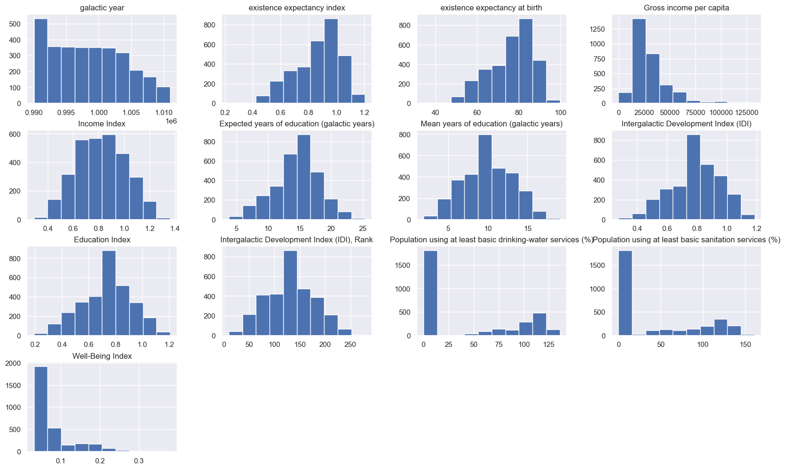

# Data Analysis and Machine Learning Project

This project demonstrates the usage of numpy, pandas, and scikit-learn (sklearn) libraries for data manipulation, analysis, and machine learning modeling.

## Installation

To run this project, you need to have Python installed on your system along with numpy, pandas, and scikit-learn libraries.

You can install numpy, pandas, and scikit-learn using pip:

```bash
pip install numpy pandas scikit-learn
```

## Usage

1. Clone this repository to your local machine.
2. Install the required dependencies as mentioned above.
3. Run the Python script `main.py` to execute the demonstration.

## Description

This project contains Python scripts demonstrating basic usage of numpy, pandas, and scikit-learn libraries:

- `main.py`: This script contains example code for basic operations using numpy, pandas, and scikit-learn models.
- `data.csv`: Sample CSV file used for demonstration purposes.

### Maximum Uses in Data

1. **numpy**: Used for numerical computing and handling multi-dimensional arrays efficiently. Commonly used for data preprocessing, manipulation, and mathematical operations.
2. **pandas**: Used for data manipulation and analysis, especially with tabular data. Commonly used for data cleaning, exploration, and transformation.
3. **scikit-learn (sklearn)**: Used for machine learning tasks such as classification, regression, clustering, and dimensionality reduction. Provides efficient tools for model training, evaluation, and deployment.

## License

This project is licensed under the MIT License - see the [LICENSE](LICENSE) file for details.

## Contributing

Contributions are welcome! Feel free to submit pull requests.

## Acknowledgments

- [numpy](https://numpy.org/): Library for numerical computing with Python.
- [pandas](https://pandas.pydata.org/): Library providing data structures and data analysis tools for Python.
- [scikit-learn](https://scikit-learn.org/): Simple and efficient tools for data mining and data analysis.
```


```python
import numpy as np
import pandas as pd
import warnings

warnings.filterwarnings("ignore")
```

The Python code below defines a function called `unzip_file` that is used to extract the contents of a zip file to a specified destination folder. Here's an explanation of each part of the code:

1. `import zipfile`: This line imports the `zipfile` module, which provides tools for creating, reading, writing, and extracting ZIP archives.

2. `import os`: This line imports the `os` module, which provides a portable way of using operating system-dependent functionality, such as working with directories and files.

3. `def unzip_file(zip_file, destination):`: This line defines a function named `unzip_file` that takes two parameters:
   - `zip_file`: The path to the ZIP file that needs to be extracted.
   - `destination`: The directory where the contents of the ZIP file will be extracted.

4. `with zipfile.ZipFile(zip_file, 'r') as zip_ref:`: This line opens the specified ZIP file (`zip_file`) in read mode (`'r'`) using the `ZipFile` class from the `zipfile` module. It also uses a `with` statement, which ensures that the file is properly closed after its suite finishes, even if an exception is raised during the process. The opened ZIP file object is assigned to the variable `zip_ref`.

5. `zip_ref.extractall(destination)`: This line extracts all the contents of the opened ZIP file (`zip_ref`) into the specified destination folder (`destination`). The `extractall()` method extracts all files and directories from the ZIP archive to the current working directory or the directory specified by `path`.

6. `zip_file = 'MSC DSA Scholars Exam Data (1).zip'`: This line defines the path to the ZIP file that needs to be extracted.

7. `destination = './'`: This line defines the destination directory where the contents of the ZIP file will be extracted. In this case, it's set to the current directory (`'./'`).

8. `if not os.path.exists(destination):`: This line checks if the specified destination directory does not exist.

9. `os.makedirs(destination)`: If the destination directory does not exist, this line creates the directory along with any necessary parent directories. This ensures that the destination directory exists before extracting the ZIP file.

10. `unzip_file(zip_file, destination)`: This line calls the `unzip_file` function, passing the path to the ZIP file and the destination directory as arguments, which triggers the extraction process.

Overall, this code provides a convenient way to extract the contents of a ZIP file using Python.


```python
import zipfile
import os

def unzip_file(zip_file, destination):
    with zipfile.ZipFile(zip_file, 'r') as zip_ref:
        zip_ref.extractall(destination)

# Example usage
zip_file = 'MSC DSA Scholars Exam Data (1).zip'
destination = './'

if not os.path.exists(destination):
    os.makedirs(destination)

unzip_file(zip_file, destination)

```


```python
train_data = pd.read_csv('./Data/train_data.csv')
test_data = pd.read_csv('./Data/validation.csv')
```


```python
def missing_percentage(df):
    # Count the number of missing values in each column
    missing_values = df.isnull().sum()

    # Total number of rows in the dataframe
    total_rows = len(df)

    # Calculate the percentage of missing values in each column
    percentage_missing_values = (missing_values / total_rows) * 100
    return  percentage_missing_values
```


```python
train_missing = missing_percentage(train_data)
test_missing = missing_percentage(test_data)

```


```python
train_missing = train_missing.reset_index().rename(columns={'index': 'column', 0: 'missing%'})
```


```python
cols = train_missing[train_missing['missing%']>70]['column'].to_list()
```


```python
train_data.drop(cols, axis=1, inplace=True)
```


```python
test_data.drop(cols, axis=1, inplace=True)
test_data
```


<div>
<style scoped>
    .dataframe tbody tr th:only-of-type {
        vertical-align: middle;
    }

    .dataframe tbody tr th {
        vertical-align: top;
    }

    .dataframe thead th {
        text-align: right;
    }
</style>
<table border="1" class="dataframe">
  <thead>
    <tr style="text-align: right;">
      <th></th>
      <th>ID</th>
      <th>galactic year</th>
      <th>galaxy</th>
      <th>existence expectancy index</th>
      <th>existence expectancy at birth</th>
      <th>Gross income per capita</th>
      <th>Income Index</th>
      <th>Expected years of education (galactic years)</th>
      <th>Mean years of education (galactic years)</th>
      <th>Intergalactic Development Index (IDI)</th>
      <th>Education Index</th>
      <th>Intergalactic Development Index (IDI), Rank</th>
      <th>Population using at least basic drinking-water services (%)</th>
      <th>Population using at least basic sanitation services (%)</th>
      <th>Predicted Well-Being Index</th>
    </tr>
  </thead>
  <tbody>
    <tr>
      <th>0</th>
      <td>886447</td>
      <td>1004004</td>
      <td>Andromeda Galaxy (M31)</td>
      <td>0.803915</td>
      <td>82.718434</td>
      <td>17299.57148</td>
      <td>0.691448</td>
      <td>16.083635</td>
      <td>11.282011</td>
      <td>0.715746</td>
      <td>0.745786</td>
      <td>191.852274</td>
      <td>70.135059</td>
      <td>65.908117</td>
      <td>NaN</td>
    </tr>
    <tr>
      <th>1</th>
      <td>687564</td>
      <td>1005006</td>
      <td>Andromeda Galaxy (M31)</td>
      <td>0.860011</td>
      <td>73.682279</td>
      <td>24971.71631</td>
      <td>0.669550</td>
      <td>12.858577</td>
      <td>10.493260</td>
      <td>0.727915</td>
      <td>0.806982</td>
      <td>172.983630</td>
      <td>67.810196</td>
      <td>57.864919</td>
      <td>NaN</td>
    </tr>
    <tr>
      <th>2</th>
      <td>494935</td>
      <td>1006009</td>
      <td>Andromeda Galaxy (M31)</td>
      <td>0.810644</td>
      <td>68.456526</td>
      <td>15943.82977</td>
      <td>0.766118</td>
      <td>14.236676</td>
      <td>9.962169</td>
      <td>0.757072</td>
      <td>0.852921</td>
      <td>180.488519</td>
      <td>88.523680</td>
      <td>71.524010</td>
      <td>NaN</td>
    </tr>
    <tr>
      <th>3</th>
      <td>378919</td>
      <td>1015056</td>
      <td>Andromeda Galaxy (M31)</td>
      <td>0.837170</td>
      <td>68.742404</td>
      <td>20952.63665</td>
      <td>0.757196</td>
      <td>14.281498</td>
      <td>10.329880</td>
      <td>0.759207</td>
      <td>0.801123</td>
      <td>186.040542</td>
      <td>82.525798</td>
      <td>69.342027</td>
      <td>NaN</td>
    </tr>
    <tr>
      <th>4</th>
      <td>421878</td>
      <td>1004004</td>
      <td>Andromeda I</td>
      <td>0.749034</td>
      <td>72.093220</td>
      <td>30068.14043</td>
      <td>0.641228</td>
      <td>12.510524</td>
      <td>7.132999</td>
      <td>0.673619</td>
      <td>0.528564</td>
      <td>155.296209</td>
      <td>73.688089</td>
      <td>55.494078</td>
      <td>NaN</td>
    </tr>
    <tr>
      <th>...</th>
      <td>...</td>
      <td>...</td>
      <td>...</td>
      <td>...</td>
      <td>...</td>
      <td>...</td>
      <td>...</td>
      <td>...</td>
      <td>...</td>
      <td>...</td>
      <td>...</td>
      <td>...</td>
      <td>...</td>
      <td>...</td>
      <td>...</td>
    </tr>
    <tr>
      <th>715</th>
      <td>389587</td>
      <td>1015056</td>
      <td>Willman 1</td>
      <td>1.010563</td>
      <td>92.515213</td>
      <td>61890.59381</td>
      <td>1.219435</td>
      <td>18.016207</td>
      <td>13.395910</td>
      <td>1.020538</td>
      <td>0.871133</td>
      <td>99.716757</td>
      <td>119.441022</td>
      <td>124.641722</td>
      <td>NaN</td>
    </tr>
    <tr>
      <th>716</th>
      <td>17112</td>
      <td>1003002</td>
      <td>Wolf-Lundmark-Melotte (WLM, DDO 221)</td>
      <td>0.628426</td>
      <td>58.772174</td>
      <td>26523.82527</td>
      <td>0.572390</td>
      <td>9.186143</td>
      <td>3.807712</td>
      <td>0.525476</td>
      <td>0.366503</td>
      <td>226.243698</td>
      <td>66.168323</td>
      <td>59.277475</td>
      <td>NaN</td>
    </tr>
    <tr>
      <th>717</th>
      <td>583782</td>
      <td>1004004</td>
      <td>Wolf-Lundmark-Melotte (WLM, DDO 221)</td>
      <td>0.603825</td>
      <td>58.301528</td>
      <td>10659.49479</td>
      <td>0.629569</td>
      <td>7.827124</td>
      <td>4.244244</td>
      <td>0.615265</td>
      <td>0.402917</td>
      <td>246.407020</td>
      <td>73.400255</td>
      <td>40.624599</td>
      <td>NaN</td>
    </tr>
    <tr>
      <th>718</th>
      <td>823832</td>
      <td>1005006</td>
      <td>Wolf-Lundmark-Melotte (WLM, DDO 221)</td>
      <td>0.574464</td>
      <td>53.416728</td>
      <td>23157.55806</td>
      <td>0.627428</td>
      <td>9.626455</td>
      <td>6.992821</td>
      <td>0.464677</td>
      <td>0.402599</td>
      <td>214.937772</td>
      <td>79.453556</td>
      <td>68.800272</td>
      <td>NaN</td>
    </tr>
    <tr>
      <th>719</th>
      <td>872042</td>
      <td>1006009</td>
      <td>Wolf-Lundmark-Melotte (WLM, DDO 221)</td>
      <td>0.614594</td>
      <td>58.751698</td>
      <td>24016.06785</td>
      <td>0.623884</td>
      <td>10.522855</td>
      <td>5.472547</td>
      <td>0.547071</td>
      <td>0.501966</td>
      <td>228.390716</td>
      <td>76.616666</td>
      <td>32.577694</td>
      <td>NaN</td>
    </tr>
  </tbody>
</table>
<p>720 rows × 15 columns</p>
</div>


```python
test_data.info()
```

    <class 'pandas.core.frame.DataFrame'>
    RangeIndex: 720 entries, 0 to 719
    Data columns (total 15 columns):
     #   Column                                                       Non-Null Count  Dtype  
    ---  ------                                                       --------------  -----  
     0   ID                                                           720 non-null    int64  
     1   galactic year                                                720 non-null    int64  
     2   galaxy                                                       720 non-null    object 
     3   existence expectancy index                                   720 non-null    float64
     4   existence expectancy at birth                                720 non-null    float64
     5   Gross income per capita                                      720 non-null    float64
     6   Income Index                                                 720 non-null    float64
     7   Expected years of education (galactic years)                 720 non-null    float64
     8   Mean years of education (galactic years)                     717 non-null    float64
     9   Intergalactic Development Index (IDI)                        717 non-null    float64
     10  Education Index                                              717 non-null    float64
     11  Intergalactic Development Index (IDI), Rank                  713 non-null    float64
     12  Population using at least basic drinking-water services (%)  715 non-null    float64
     13  Population using at least basic sanitation services (%)      713 non-null    float64
     14  Predicted Well-Being Index                                   0 non-null      float64
    dtypes: float64(12), int64(2), object(1)
    memory usage: 84.5+ KB
    


```python
train_data.isna().sum()
```


    ID                                                                0
    galactic year                                                     0
    galaxy                                                            0
    existence expectancy index                                        1
    existence expectancy at birth                                     1
    Gross income per capita                                          28
    Income Index                                                     28
    Expected years of education (galactic years)                    129
    Mean years of education (galactic years)                        355
    Intergalactic Development Index (IDI)                           381
    Education Index                                                 381
    Intergalactic Development Index (IDI), Rank                     419
    Population using at least basic drinking-water services (%)    1811
    Population using at least basic sanitation services (%)        1815
    Well-Being Index                                                  0
    dtype: int64


```python
test_data.isna().sum()
```


    ID                                                               0
    galactic year                                                    0
    galaxy                                                           0
    existence expectancy index                                       0
    existence expectancy at birth                                    0
    Gross income per capita                                          0
    Income Index                                                     0
    Expected years of education (galactic years)                     0
    Mean years of education (galactic years)                         3
    Intergalactic Development Index (IDI)                            3
    Education Index                                                  3
    Intergalactic Development Index (IDI), Rank                      7
    Population using at least basic drinking-water services (%)      5
    Population using at least basic sanitation services (%)          7
    Predicted Well-Being Index                                     720
    dtype: int64


```python
train_data.dtypes
```


    ID                                                               int64
    galactic year                                                    int64
    galaxy                                                          object
    existence expectancy index                                     float64
    existence expectancy at birth                                  float64
    Gross income per capita                                        float64
    Income Index                                                   float64
    Expected years of education (galactic years)                   float64
    Mean years of education (galactic years)                       float64
    Intergalactic Development Index (IDI)                          float64
    Education Index                                                float64
    Intergalactic Development Index (IDI), Rank                    float64
    Population using at least basic drinking-water services (%)    float64
    Population using at least basic sanitation services (%)        float64
    Well-Being Index                                               float64
    dtype: object


```python
missing_percentage(train_data)
```


    ID                                                              0.000000
    galactic year                                                   0.000000
    galaxy                                                          0.000000
    existence expectancy index                                      0.032289
    existence expectancy at birth                                   0.032289
    Gross income per capita                                         0.904101
    Income Index                                                    0.904101
    Expected years of education (galactic years)                    4.165321
    Mean years of education (galactic years)                       11.462706
    Intergalactic Development Index (IDI)                          12.302228
    Education Index                                                12.302228
    Intergalactic Development Index (IDI), Rank                    13.529222
    Population using at least basic drinking-water services (%)    58.475944
    Population using at least basic sanitation services (%)        58.605102
    Well-Being Index                                                0.000000
    dtype: float64


```python
# Use code 0 to mean unknown 
# For Population using at least basic drinking-water services (%)
# And Population using at least basic sanitation services (%)
train_data['Population using at least basic drinking-water services (%)'].fillna(0, inplace=True)
train_data['Population using at least basic sanitation services (%)'].fillna(0, inplace=True)

# Test Data
test_data['Population using at least basic drinking-water services (%)'].fillna(0, inplace=True)
test_data['Population using at least basic sanitation services (%)'].fillna(0, inplace=True)
```


```python
# Replace missing values with median for all columns
train_data.fillna(train_data.median(), inplace=True)

test_data.fillna(test_data.median(), inplace=True)
```


```python
train_data.isna().sum()
```


    ID                                                             0
    galactic year                                                  0
    galaxy                                                         0
    existence expectancy index                                     0
    existence expectancy at birth                                  0
    Gross income per capita                                        0
    Income Index                                                   0
    Expected years of education (galactic years)                   0
    Mean years of education (galactic years)                       0
    Intergalactic Development Index (IDI)                          0
    Education Index                                                0
    Intergalactic Development Index (IDI), Rank                    0
    Population using at least basic drinking-water services (%)    0
    Population using at least basic sanitation services (%)        0
    Well-Being Index                                               0
    dtype: int64


```python
test_data.isna().sum()
```


    ID                                                               0
    galactic year                                                    0
    galaxy                                                           0
    existence expectancy index                                       0
    existence expectancy at birth                                    0
    Gross income per capita                                          0
    Income Index                                                     0
    Expected years of education (galactic years)                     0
    Mean years of education (galactic years)                         0
    Intergalactic Development Index (IDI)                            0
    Education Index                                                  0
    Intergalactic Development Index (IDI), Rank                      0
    Population using at least basic drinking-water services (%)      0
    Population using at least basic sanitation services (%)          0
    Predicted Well-Being Index                                     720
    dtype: int64


```python
test_data.drop(['ID', 'Predicted Well-Being Index'], axis=1, inplace=True)

testing_data = test_data.copy()
```

### Basic EDA


```python
import seaborn as sns
import matplotlib.pyplot as plt
sns.set()

int_cols = train_data.iloc[:,1:].select_dtypes(include=['float', 'int']).columns.to_list()
train_data.iloc[:,1:][int_cols].hist(figsize=(20,12))
plt.title("Distributions of Numeric Variables", size=20)
plt.show()
```


    

    


```python
train_data['galaxy'].value_counts()
```


    Tucana Dwarf                                   22
    Andromeda XII                                  22
    Andromeda XIX[60]                              22
    Andromeda XXII[57]                             22
    Pisces II                                      21
                                                   ..
    Sagittarius Dwarf Irregular Galaxy (SagDIG)    12
    Andromeda XXI[57]                              12
    Andromeda XXIX                                 12
    Wolf-Lundmark-Melotte (WLM, DDO 221)           10
    NGC 5253                                        1
    Name: galaxy, Length: 181, dtype: int64


## Feature Scaling


```python
# Checking the minimu and maximum well-being index
print('Minimum value: ', train_data.iloc[:,-1].min())
print('Maximum value: ', train_data.iloc[:,-1].max())
```

    Minimum value:  0.031476525
    Maximum value:  0.379856945
    


```python
# Create the features and label
X_train = train_data.iloc[:,:-1]
y_train = train_data.iloc[:,-1].values
y_train = y_train.reshape(len(y_train), 1)
```


```python
X_train.drop('ID', axis=1, inplace=True)
```


```python
from sklearn.preprocessing import StandardScaler

sc = StandardScaler()
# Standardise the numerical columns
X_train[int_cols[:-1]] = sc.fit_transform(X_train[int_cols[:-1]])

X_train
```


<div>
<style scoped>
    .dataframe tbody tr th:only-of-type {
        vertical-align: middle;
    }

    .dataframe tbody tr th {
        vertical-align: top;
    }

    .dataframe thead th {
        text-align: right;
    }
</style>
<table border="1" class="dataframe">
  <thead>
    <tr style="text-align: right;">
      <th></th>
      <th>galactic year</th>
      <th>galaxy</th>
      <th>existence expectancy index</th>
      <th>existence expectancy at birth</th>
      <th>Gross income per capita</th>
      <th>Income Index</th>
      <th>Expected years of education (galactic years)</th>
      <th>Mean years of education (galactic years)</th>
      <th>Intergalactic Development Index (IDI)</th>
      <th>Education Index</th>
      <th>Intergalactic Development Index (IDI), Rank</th>
      <th>Population using at least basic drinking-water services (%)</th>
      <th>Population using at least basic sanitation services (%)</th>
    </tr>
  </thead>
  <tbody>
    <tr>
      <th>0</th>
      <td>0.652936</td>
      <td>Antlia B</td>
      <td>-1.453665</td>
      <td>-1.879350</td>
      <td>-0.728854</td>
      <td>-1.865082</td>
      <td>-1.859670</td>
      <td>-1.585308</td>
      <td>-1.745036</td>
      <td>-1.405577</td>
      <td>2.441131</td>
      <td>-0.171462</td>
      <td>0.321030</td>
    </tr>
    <tr>
      <th>1</th>
      <td>0.098936</td>
      <td>KKH 11 (ZOAG G135.74-04.53)</td>
      <td>0.649334</td>
      <td>0.448507</td>
      <td>-1.066265</td>
      <td>-0.320149</td>
      <td>0.399497</td>
      <td>0.976402</td>
      <td>0.067469</td>
      <td>0.560262</td>
      <td>0.111443</td>
      <td>-0.813976</td>
      <td>-0.772005</td>
    </tr>
    <tr>
      <th>2</th>
      <td>-1.006478</td>
      <td>Leo IV Dwarf</td>
      <td>0.804257</td>
      <td>0.592478</td>
      <td>1.494863</td>
      <td>1.103672</td>
      <td>0.871894</td>
      <td>0.434051</td>
      <td>1.075299</td>
      <td>0.843929</td>
      <td>-1.215379</td>
      <td>-0.813976</td>
      <td>-0.772005</td>
    </tr>
    <tr>
      <th>3</th>
      <td>-0.638376</td>
      <td>NGC 185</td>
      <td>0.857873</td>
      <td>-0.053390</td>
      <td>0.207177</td>
      <td>-0.575946</td>
      <td>-0.246707</td>
      <td>0.020438</td>
      <td>0.105370</td>
      <td>0.079619</td>
      <td>0.003442</td>
      <td>-0.813976</td>
      <td>-0.772005</td>
    </tr>
    <tr>
      <th>4</th>
      <td>-0.454140</td>
      <td>Grus I</td>
      <td>1.139049</td>
      <td>0.684687</td>
      <td>-0.760023</td>
      <td>0.684476</td>
      <td>-0.263606</td>
      <td>0.547781</td>
      <td>1.025493</td>
      <td>0.347874</td>
      <td>0.194360</td>
      <td>-0.813976</td>
      <td>-0.772005</td>
    </tr>
    <tr>
      <th>...</th>
      <td>...</td>
      <td>...</td>
      <td>...</td>
      <td>...</td>
      <td>...</td>
      <td>...</td>
      <td>...</td>
      <td>...</td>
      <td>...</td>
      <td>...</td>
      <td>...</td>
      <td>...</td>
      <td>...</td>
    </tr>
    <tr>
      <th>3092</th>
      <td>1.392832</td>
      <td>NGC 1560</td>
      <td>0.449833</td>
      <td>0.786730</td>
      <td>-0.332977</td>
      <td>0.479195</td>
      <td>-0.750947</td>
      <td>-0.092025</td>
      <td>0.315397</td>
      <td>0.628662</td>
      <td>0.003442</td>
      <td>1.139944</td>
      <td>0.868632</td>
    </tr>
    <tr>
      <th>3093</th>
      <td>1.022699</td>
      <td>NGC 55</td>
      <td>0.482392</td>
      <td>0.821381</td>
      <td>1.341904</td>
      <td>1.601038</td>
      <td>0.266214</td>
      <td>-0.015715</td>
      <td>0.668425</td>
      <td>0.031539</td>
      <td>-0.344782</td>
      <td>0.921147</td>
      <td>1.453893</td>
    </tr>
    <tr>
      <th>3094</th>
      <td>1.022699</td>
      <td>Small Magellanic Cloud (SMC, NGC 292)</td>
      <td>0.914749</td>
      <td>0.941421</td>
      <td>-0.750025</td>
      <td>0.276015</td>
      <td>0.956628</td>
      <td>-0.418242</td>
      <td>0.888914</td>
      <td>0.188389</td>
      <td>-0.318718</td>
      <td>1.286388</td>
      <td>1.030871</td>
    </tr>
    <tr>
      <th>3095</th>
      <td>1.022699</td>
      <td>Andromeda XXIV</td>
      <td>-1.931071</td>
      <td>-1.663240</td>
      <td>-1.068557</td>
      <td>-1.204442</td>
      <td>-0.425623</td>
      <td>-1.244004</td>
      <td>-2.400054</td>
      <td>-0.973179</td>
      <td>1.961295</td>
      <td>0.754027</td>
      <td>0.030772</td>
    </tr>
    <tr>
      <th>3096</th>
      <td>1.207673</td>
      <td>Maffei 2</td>
      <td>0.594779</td>
      <td>0.223064</td>
      <td>-0.706428</td>
      <td>-0.760350</td>
      <td>-1.456106</td>
      <td>-1.032483</td>
      <td>-0.697092</td>
      <td>-0.993140</td>
      <td>2.027611</td>
      <td>0.969694</td>
      <td>0.079954</td>
    </tr>
  </tbody>
</table>
<p>3097 rows × 13 columns</p>
</div>


### Standardizing the validation dataset


```python
test_int_cols = test_data.drop('galaxy', axis=1).columns.to_list()
test_data[test_int_cols] = sc.transform(test_data[test_int_cols])
```

### Encoding Categorical Variables


```python
X_train = pd.get_dummies(X_train, drop_first=True)

test_data = pd.get_dummies(test_data, drop_first=True)
```

### Splitting the dataset  into training and testing sets


```python
from sklearn.model_selection import train_test_split
X_train, X_val, y_train, y_val = train_test_split(X_train, y_train, test_size=0.2)
```

### Using Sklearn Pipeline to preprocess and fit a model


```python
from sklearn.preprocessing import StandardScaler
import numpy as np

# Assuming X_train is a sparse matrix
std_scaler = StandardScaler(with_mean=False).fit(X_train)

def preprocessor(X):
    D = np.copy(X)
    D = std_scaler.transform(D)
    return D
```


```python
from sklearn.preprocessing import FunctionTransformer

preprocessor_transformer = FunctionTransformer(preprocessor)
preprocessor_transformer
```


<style>#sk-container-id-1 {color: black;background-color: white;}#sk-container-id-1 pre{padding: 0;}#sk-container-id-1 div.sk-toggleable {background-color: white;}#sk-container-id-1 label.sk-toggleable__label {cursor: pointer;display: block;width: 100%;margin-bottom: 0;padding: 0.3em;box-sizing: border-box;text-align: center;}#sk-container-id-1 label.sk-toggleable__label-arrow:before {content: "▸";float: left;margin-right: 0.25em;color: #696969;}#sk-container-id-1 label.sk-toggleable__label-arrow:hover:before {color: black;}#sk-container-id-1 div.sk-estimator:hover label.sk-toggleable__label-arrow:before {color: black;}#sk-container-id-1 div.sk-toggleable__content {max-height: 0;max-width: 0;overflow: hidden;text-align: left;background-color: #f0f8ff;}#sk-container-id-1 div.sk-toggleable__content pre {margin: 0.2em;color: black;border-radius: 0.25em;background-color: #f0f8ff;}#sk-container-id-1 input.sk-toggleable__control:checked~div.sk-toggleable__content {max-height: 200px;max-width: 100%;overflow: auto;}#sk-container-id-1 input.sk-toggleable__control:checked~label.sk-toggleable__label-arrow:before {content: "▾";}#sk-container-id-1 div.sk-estimator input.sk-toggleable__control:checked~label.sk-toggleable__label {background-color: #d4ebff;}#sk-container-id-1 div.sk-label input.sk-toggleable__control:checked~label.sk-toggleable__label {background-color: #d4ebff;}#sk-container-id-1 input.sk-hidden--visually {border: 0;clip: rect(1px 1px 1px 1px);clip: rect(1px, 1px, 1px, 1px);height: 1px;margin: -1px;overflow: hidden;padding: 0;position: absolute;width: 1px;}#sk-container-id-1 div.sk-estimator {font-family: monospace;background-color: #f0f8ff;border: 1px dotted black;border-radius: 0.25em;box-sizing: border-box;margin-bottom: 0.5em;}#sk-container-id-1 div.sk-estimator:hover {background-color: #d4ebff;}#sk-container-id-1 div.sk-parallel-item::after {content: "";width: 100%;border-bottom: 1px solid gray;flex-grow: 1;}#sk-container-id-1 div.sk-label:hover label.sk-toggleable__label {background-color: #d4ebff;}#sk-container-id-1 div.sk-serial::before {content: "";position: absolute;border-left: 1px solid gray;box-sizing: border-box;top: 0;bottom: 0;left: 50%;z-index: 0;}#sk-container-id-1 div.sk-serial {display: flex;flex-direction: column;align-items: center;background-color: white;padding-right: 0.2em;padding-left: 0.2em;position: relative;}#sk-container-id-1 div.sk-item {position: relative;z-index: 1;}#sk-container-id-1 div.sk-parallel {display: flex;align-items: stretch;justify-content: center;background-color: white;position: relative;}#sk-container-id-1 div.sk-item::before, #sk-container-id-1 div.sk-parallel-item::before {content: "";position: absolute;border-left: 1px solid gray;box-sizing: border-box;top: 0;bottom: 0;left: 50%;z-index: -1;}#sk-container-id-1 div.sk-parallel-item {display: flex;flex-direction: column;z-index: 1;position: relative;background-color: white;}#sk-container-id-1 div.sk-parallel-item:first-child::after {align-self: flex-end;width: 50%;}#sk-container-id-1 div.sk-parallel-item:last-child::after {align-self: flex-start;width: 50%;}#sk-container-id-1 div.sk-parallel-item:only-child::after {width: 0;}#sk-container-id-1 div.sk-dashed-wrapped {border: 1px dashed gray;margin: 0 0.4em 0.5em 0.4em;box-sizing: border-box;padding-bottom: 0.4em;background-color: white;}#sk-container-id-1 div.sk-label label {font-family: monospace;font-weight: bold;display: inline-block;line-height: 1.2em;}#sk-container-id-1 div.sk-label-container {text-align: center;}#sk-container-id-1 div.sk-container {/* jupyter's `normalize.less` sets `[hidden] { display: none; }` but bootstrap.min.css set `[hidden] { display: none !important; }` so we also need the `!important` here to be able to override the default hidden behavior on the sphinx rendered scikit-learn.org. See: https://github.com/scikit-learn/scikit-learn/issues/21755 */display: inline-block !important;position: relative;}#sk-container-id-1 div.sk-text-repr-fallback {display: none;}</style><div id="sk-container-id-1" class="sk-top-container"><div class="sk-text-repr-fallback"><pre>FunctionTransformer(func=&lt;function preprocessor at 0x0000020890559CA0&gt;)</pre><b>In a Jupyter environment, please rerun this cell to show the HTML representation or trust the notebook. <br />On GitHub, the HTML representation is unable to render, please try loading this page with nbviewer.org.</b></div><div class="sk-container" hidden><div class="sk-item"><div class="sk-estimator sk-toggleable"><input class="sk-toggleable__control sk-hidden--visually" id="sk-estimator-id-1" type="checkbox" checked><label for="sk-estimator-id-1" class="sk-toggleable__label sk-toggleable__label-arrow">FunctionTransformer</label><div class="sk-toggleable__content"><pre>FunctionTransformer(func=&lt;function preprocessor at 0x0000020890559CA0&gt;)</pre></div></div></div></div></div>


```python
from sklearn.pipeline import Pipeline
from sklearn.linear_model import LinearRegression

p1 = Pipeline([('scaler', preprocessor_transformer),
              ('Linear Regression', LinearRegression())])
p1
```


<style>#sk-container-id-2 {color: black;background-color: white;}#sk-container-id-2 pre{padding: 0;}#sk-container-id-2 div.sk-toggleable {background-color: white;}#sk-container-id-2 label.sk-toggleable__label {cursor: pointer;display: block;width: 100%;margin-bottom: 0;padding: 0.3em;box-sizing: border-box;text-align: center;}#sk-container-id-2 label.sk-toggleable__label-arrow:before {content: "▸";float: left;margin-right: 0.25em;color: #696969;}#sk-container-id-2 label.sk-toggleable__label-arrow:hover:before {color: black;}#sk-container-id-2 div.sk-estimator:hover label.sk-toggleable__label-arrow:before {color: black;}#sk-container-id-2 div.sk-toggleable__content {max-height: 0;max-width: 0;overflow: hidden;text-align: left;background-color: #f0f8ff;}#sk-container-id-2 div.sk-toggleable__content pre {margin: 0.2em;color: black;border-radius: 0.25em;background-color: #f0f8ff;}#sk-container-id-2 input.sk-toggleable__control:checked~div.sk-toggleable__content {max-height: 200px;max-width: 100%;overflow: auto;}#sk-container-id-2 input.sk-toggleable__control:checked~label.sk-toggleable__label-arrow:before {content: "▾";}#sk-container-id-2 div.sk-estimator input.sk-toggleable__control:checked~label.sk-toggleable__label {background-color: #d4ebff;}#sk-container-id-2 div.sk-label input.sk-toggleable__control:checked~label.sk-toggleable__label {background-color: #d4ebff;}#sk-container-id-2 input.sk-hidden--visually {border: 0;clip: rect(1px 1px 1px 1px);clip: rect(1px, 1px, 1px, 1px);height: 1px;margin: -1px;overflow: hidden;padding: 0;position: absolute;width: 1px;}#sk-container-id-2 div.sk-estimator {font-family: monospace;background-color: #f0f8ff;border: 1px dotted black;border-radius: 0.25em;box-sizing: border-box;margin-bottom: 0.5em;}#sk-container-id-2 div.sk-estimator:hover {background-color: #d4ebff;}#sk-container-id-2 div.sk-parallel-item::after {content: "";width: 100%;border-bottom: 1px solid gray;flex-grow: 1;}#sk-container-id-2 div.sk-label:hover label.sk-toggleable__label {background-color: #d4ebff;}#sk-container-id-2 div.sk-serial::before {content: "";position: absolute;border-left: 1px solid gray;box-sizing: border-box;top: 0;bottom: 0;left: 50%;z-index: 0;}#sk-container-id-2 div.sk-serial {display: flex;flex-direction: column;align-items: center;background-color: white;padding-right: 0.2em;padding-left: 0.2em;position: relative;}#sk-container-id-2 div.sk-item {position: relative;z-index: 1;}#sk-container-id-2 div.sk-parallel {display: flex;align-items: stretch;justify-content: center;background-color: white;position: relative;}#sk-container-id-2 div.sk-item::before, #sk-container-id-2 div.sk-parallel-item::before {content: "";position: absolute;border-left: 1px solid gray;box-sizing: border-box;top: 0;bottom: 0;left: 50%;z-index: -1;}#sk-container-id-2 div.sk-parallel-item {display: flex;flex-direction: column;z-index: 1;position: relative;background-color: white;}#sk-container-id-2 div.sk-parallel-item:first-child::after {align-self: flex-end;width: 50%;}#sk-container-id-2 div.sk-parallel-item:last-child::after {align-self: flex-start;width: 50%;}#sk-container-id-2 div.sk-parallel-item:only-child::after {width: 0;}#sk-container-id-2 div.sk-dashed-wrapped {border: 1px dashed gray;margin: 0 0.4em 0.5em 0.4em;box-sizing: border-box;padding-bottom: 0.4em;background-color: white;}#sk-container-id-2 div.sk-label label {font-family: monospace;font-weight: bold;display: inline-block;line-height: 1.2em;}#sk-container-id-2 div.sk-label-container {text-align: center;}#sk-container-id-2 div.sk-container {/* jupyter's `normalize.less` sets `[hidden] { display: none; }` but bootstrap.min.css set `[hidden] { display: none !important; }` so we also need the `!important` here to be able to override the default hidden behavior on the sphinx rendered scikit-learn.org. See: https://github.com/scikit-learn/scikit-learn/issues/21755 */display: inline-block !important;position: relative;}#sk-container-id-2 div.sk-text-repr-fallback {display: none;}</style><div id="sk-container-id-2" class="sk-top-container"><div class="sk-text-repr-fallback"><pre>Pipeline(steps=[(&#x27;scaler&#x27;,
                 FunctionTransformer(func=&lt;function preprocessor at 0x0000020890559CA0&gt;)),
                (&#x27;Linear Regression&#x27;, LinearRegression())])</pre><b>In a Jupyter environment, please rerun this cell to show the HTML representation or trust the notebook. <br />On GitHub, the HTML representation is unable to render, please try loading this page with nbviewer.org.</b></div><div class="sk-container" hidden><div class="sk-item sk-dashed-wrapped"><div class="sk-label-container"><div class="sk-label sk-toggleable"><input class="sk-toggleable__control sk-hidden--visually" id="sk-estimator-id-2" type="checkbox" ><label for="sk-estimator-id-2" class="sk-toggleable__label sk-toggleable__label-arrow">Pipeline</label><div class="sk-toggleable__content"><pre>Pipeline(steps=[(&#x27;scaler&#x27;,
                 FunctionTransformer(func=&lt;function preprocessor at 0x0000020890559CA0&gt;)),
                (&#x27;Linear Regression&#x27;, LinearRegression())])</pre></div></div></div><div class="sk-serial"><div class="sk-item"><div class="sk-estimator sk-toggleable"><input class="sk-toggleable__control sk-hidden--visually" id="sk-estimator-id-3" type="checkbox" ><label for="sk-estimator-id-3" class="sk-toggleable__label sk-toggleable__label-arrow">FunctionTransformer</label><div class="sk-toggleable__content"><pre>FunctionTransformer(func=&lt;function preprocessor at 0x0000020890559CA0&gt;)</pre></div></div></div><div class="sk-item"><div class="sk-estimator sk-toggleable"><input class="sk-toggleable__control sk-hidden--visually" id="sk-estimator-id-4" type="checkbox" ><label for="sk-estimator-id-4" class="sk-toggleable__label sk-toggleable__label-arrow">LinearRegression</label><div class="sk-toggleable__content"><pre>LinearRegression()</pre></div></div></div></div></div></div></div>


```python
from sklearn.metrics import mean_absolute_error, r2_score

def fit_and_print(p, X_train=X_train, X_test=X_val, y_train=y_train, y_test=y_val):
    # Fit the transformer
    p.fit(X_train, y_train)
    # Predict the train and test outputs
    training_prediction = p.predict(X_train)
    test_prediction = p.predict(X_test)
    
    # Calculate Mean Absolute Error
    train_mae = mean_absolute_error(training_prediction, y_train)
    test_mae = mean_absolute_error(test_prediction, y_test)
    
    # Calculate R-squared
    train_r2 = r2_score(y_train, training_prediction)
    test_r2 = r2_score(y_test, test_prediction)
    
    # Print the errors
    print("Training Mean Absolute Error: {:.2f}".format(train_mae))
    print("Training R-squared: {:.2f}%".format(train_r2 * 100))
    print("Test Mean Absolute Error: {:.2f}".format(test_mae))
    print("Test R-squared: {:.2f}%".format(test_r2 * 100))

```

### Fit a Linear Regression


```python
fit_and_print(p1)
```

    Training Mean Absolute Error: 0.00
    Training R-squared: 99.03%
    Test Mean Absolute Error: 0.00
    Test R-squared: 99.26%
    


```python
# Perform Grid search
from sklearn.model_selection import GridSearchCV
from sklearn.neighbors import KNeighborsRegressor as KNR

# Create a KNN Regressor
knn = KNR()

# Define Hyperparameters to tune
param_grid = {
    'n_neighbors': [3,5,7,9,11]
}

# Perform Grid Search
grid_search = GridSearchCV(estimator=knn, param_grid=param_grid,
                          scoring='neg_mean_squared_error', cv=5)
# Fit Grid Search to Data
grid_search.fit(X_train, y_train)
# Retrieve Best Parameters
best_params = grid_search.best_params_
best_estimator = grid_search.best_estimator_
```


```python
print("best_params: ", best_params, "\nbest_estimator: ", best_estimator)
```

    best_params:  {'n_neighbors': 3} 
    best_estimator:  KNeighborsRegressor(n_neighbors=3)
    


```python
p2 = Pipeline([('Scaler', preprocessor_transformer),
               ('KNN Regression', KNR(n_neighbors=3))])
fit_and_print(p2)
```

    Training Mean Absolute Error: 0.00
    Training R-squared: 99.84%
    Test Mean Absolute Error: 0.00
    Test R-squared: 99.64%
    

### Fit a RandomForestRegressor


```python
from sklearn.ensemble import RandomForestRegressor
p3 = Pipeline([('Scaler', preprocessor_transformer),
               ('RFR Regression', RandomForestRegressor())])
fit_and_print(p3)
```

    Training Mean Absolute Error: 0.00
    Training R-squared: 98.79%
    Test Mean Absolute Error: 0.01
    Test R-squared: 92.52%
    

### Fit SVM Regressor


```python
from sklearn.svm import SVR
p4 = Pipeline([('Scaler', preprocessor_transformer),
               ('SVR Regression', SVR(kernel="rbf"))])
fit_and_print(p4)
```

    Training Mean Absolute Error: 0.08
    Training R-squared: -125.75%
    Test Mean Absolute Error: 0.08
    Test R-squared: -69.67%
    

### Fit a Gradient Boosting Regressor


```python
from sklearn.ensemble import GradientBoostingRegressor
p5 = Pipeline([('Scaler', preprocessor_transformer),
               ('GBR Regression', GradientBoostingRegressor())])
fit_and_print(p5)
```

    Training Mean Absolute Error: 0.01
    Training R-squared: 95.03%
    Test Mean Absolute Error: 0.01
    Test R-squared: 92.87%
    

### Fit XGBOOST Regressor


```python
from xgboost import XGBRegressor

p5 = Pipeline([('Scaler', preprocessor_transformer),
               ('XGBR Regression', XGBRegressor())])
fit_and_print(p5)
```

    Training Mean Absolute Error: 0.00
    Training R-squared: 99.47%
    Test Mean Absolute Error: 0.01
    Test R-squared: 94.03%
    

## The best Performing model - KNN regressor
KNN was the best performing regressor with the following results:

```python
Training Mean Absolute Error: 0.00
Training R-squared: 99.79%
Test Mean Absolute Error: 0.00
Test R-squared: 99.80%
```


```python
train_data.drop('ID', axis=1, inplace=True)

# Assuming train_data and testing_data are your pandas DataFrames
# and 'galaxy' is a column in both DataFrames

# Get the unique values of 'galaxy' column in the training and testing datasets
train_unique = train_data['galaxy'].unique()
test_unique = testing_data['galaxy'].unique()

# Find values that are in train_unique but not in test_unique
not_in_test = set(train_unique) - set(test_unique)

# Find values that are in test_unique but not in train_unique
not_in_train = set(test_unique) - set(train_unique)

print("Values in train_unique but not in test_unique:", not_in_test)
print("Values in test_unique but not in train_unique:", not_in_train)

```

    Values in train_unique but not in test_unique: {'NGC 5253'}
    Values in test_unique but not in train_unique: set()
    


```python
import pandas as pd

# Assuming train_data and test_data are your pandas DataFrames

# Identify unique categories across both datasets
all_categories = set(train_data['galaxy']).union(set(testing_data['galaxy']))

# Reindex both datasets to include all unique categories
train_data_reindexed = train_data.reindex(columns=all_categories, fill_value=0)
test_data_reindexed = testing_data.reindex(columns=all_categories, fill_value=0)


# Perform one-hot encoding using pd.get_dummies()
train_encoded = pd.get_dummies(train_data_reindexed, drop_first=True)
test_encoded = pd.get_dummies(test_data_reindexed, drop_first=True)

other_cols = train_data.drop(['galaxy', 'Well-Being Index'], axis=1).columns.to_list()

train_encoded[other_cols] = train_data[other_cols]
test_encoded[other_cols] = testing_data[other_cols]

y = train_data['Well-Being Index']

# Now train_encoded and test_encoded contain one-hot encoded representation
# Make sure you handle other columns appropriately as needed
```


```python
# Standardize the Data
sc = StandardScaler()
train = sc.fit_transform(train_encoded)
test = sc.transform(test_encoded)

# Create KNN regressor with the best parameters
knn_regressor = KNR(n_neighbors=3)

knn_regressor.fit(train, y)

# Making test predictions
predictions = knn_regressor.predict(test)
```


```python
validation = pd.read_csv('./Data/validation.csv')
validation['Predicted Well-Being Index'] = predictions
```


```python
validation.to_csv('validation_data_with_predictions.csv', index=False)
```
